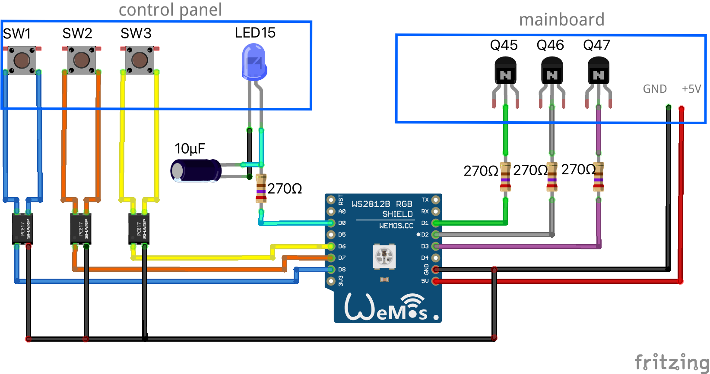

## ESP8266 MQTT Sharp-fu-y30 air purifier controller

### Disclaimer
Note: if you decide to do those changes to your air purifier, you take all the responsibility for doing so with all it's consequences such as loosing warranty for your device or even destroying it! 

### What you need
* ESP8266 WiFi controller (for example Wemos D1 mini)
* 3 x PC817-B Sharp optocouplers
* 4 x 270 ohms resistors
* 1 x 10 uF electrolytic capacitor
* some dupont jumper wiring cables
* some soldering skills

To integrate the ESP8266 with Sharp FU-Y30 air purifier you need to access both of it's PCBs. One is the mainboard and it is at the bottom of the device closed in the black plastic box. 

Second board (on the upper side of the device) contains only some buttons and LEDs, but you will need to solder some wires there as well. 

Both boards are labelled as QPWBFA085KKZZ with additional CPWB-A274KKKZ number.

### Wiring
You need to connect your ESP to the points marked as circles on the Sharp's PCBs:
* D1 pin to the Q45 transistor's base through 270 ohms resistor (this is where we read the HIGH mode device state from)
* D2 pin to the Q46 transistor's base through 270 ohms resistor (this is where we read the MEDIUM mode device state from)
* D3 pin to the Q47 transistor's base through 270 ohms resistor (this is where we read the LOW mode device state from)
* D0 pin to the LED15+ pin through 270 ohms resistor (you should also connect capacitor between the LED's pins)
* D6 to the SW3 (mode button) through optocoupler connected also to ESP's GND
* D7 to the SW2 (ion on/off button) through optocoupler connected also to ESP's GND
* D8 to the SW1 (power button) through optocoupler connected also to ESP's GND
* GND pin to GND marked on the device mainboard
* 5V pin to 5V marked on the device mainboard

Note the places you need to connect on the Sharp's PCBs:

When you connect to the Q45, Q46 and Q47, you need to solder your wires to base (B) pins of those transistors.

Be sure to properly connect the optocouplers with switch buttons on the control panels (note the polarity).

## Software
You need to create the `config.h` file by copying the `config.example.h`. Enter your WiFi data there, also include the MQTT server address. You can use some of public MQTT servers with no problem.

After you deploy your code to the ESP8266, you will be able to perform OTA updates. Just uncomment the `espota` upload protocol and change the ESP8266 IP address in the `platformio.ini` file.

## Demo
See the demo of how you can control you purifier using `mosquito` command line client:

## Home Assistant integrations
This firmware is able to integrate with Home Assistant out of the box if you have enabled the MQTT extension.

## Remote debug
You can also control the purifier via telnet on port 23 using the remote debug feature. Just connect to the ESP's IP on port 23 to see the status of the device and control it via command line.

